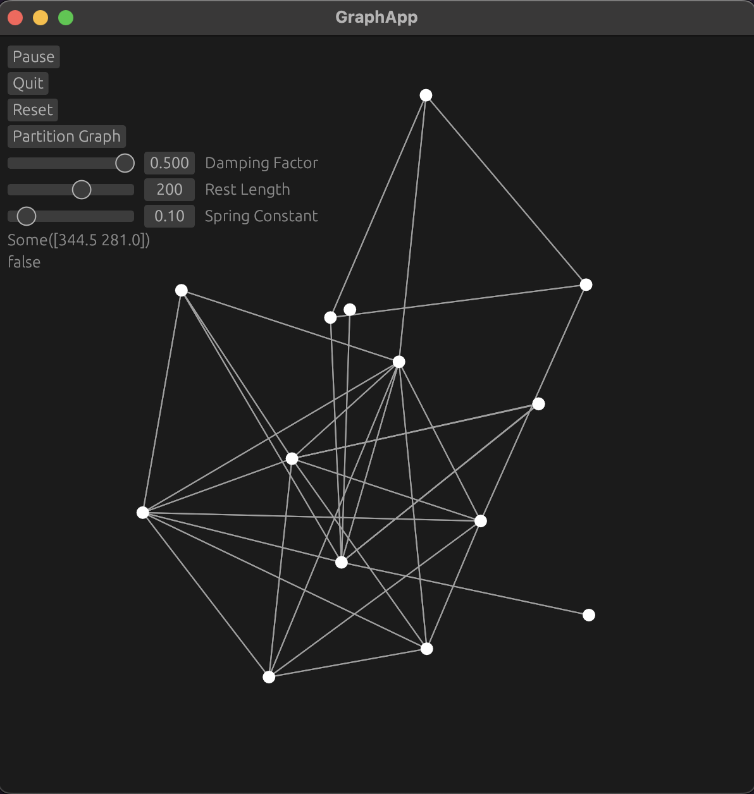
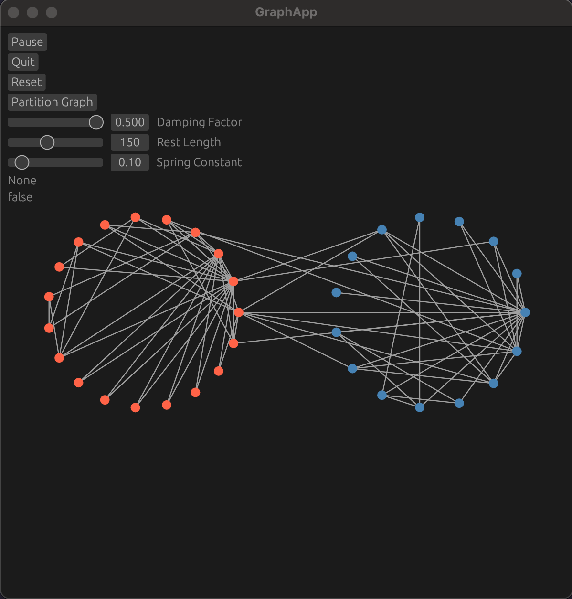

# Graph Visualization Widget [WIP] 

## Dependencies

This project uses the following dependencies:

- **eframe**: For creating the GUI.
- **nalgebra**: For linear algebra operations.
- **rand**: For generating random numbers.

## Methods Used

Graph partitioning was achieved using the Fielder vector.

1. **Calculate the normalized Laplacian matrix**.

$L = D^{-1/2} A D^{-1/2}$

where $D$ is the degree matrix and $A$ is the adjacency matrix.

2. **Calculate the eigenvectors of the Laplacian matrix**.

The Fiedler vector is the eigenvector corresponding to the second smallest eigenvalue of the Laplacian.

3. **Partition the graph**.

Use the signs of the components of the Fiedler vector to partition the graph:
   
   $` \text{Partition 1} = \{ i \mid \mathbf{v}_2(i) \geq 0 \} `$
   
   $` \text{Partition 2} = \{ i \mid \mathbf{v}_2(i) < 0 \} `$

## Screenshots

    
    

